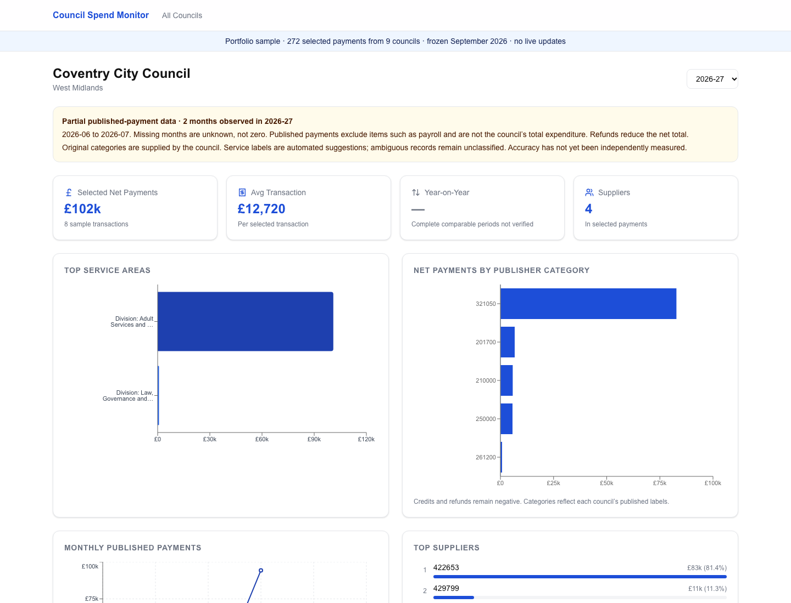

# Council Spend Monitor

An interactive transparency dashboard for **payments published by English local authorities**. It shows the original source for each example payment, distinguishes missing data from zero expenditure, and explains or declines each suggested service classification.

**Portfolio status:** This repository is an offline demonstration. The hosted Worker and its D1 database were retired on 25 September 2026 after the national import proved too costly to operate. No scheduled scraper or hosted site remains. The demo runs locally with a small, committed fixture; it makes no claim of complete national coverage.



## Run the demo

Use Node.js 22 or later:

```sh
npm ci
npm run demo:seed
npm run dev
```

Open `http://localhost:3000`, then choose a council. `npm run demo:seed` builds `data/demo.db` locally from the committed [sample fixture](data/demo-payments.json); it makes no network requests or cloud writes. You can run it again to reset the demo. `npm test`, `npm run lint`, `npm run typecheck`, and `npm run build` are the validation commands.

The sample contains **272 selected payments from nine councils**, across the five financial years 2022–23 to 2026–27 and 37 source documents. Every selected row retains its publisher file URL. It is a small extract of public source files from the development database, frozen in September 2026. It is intentionally unsuitable for estimating annual totals, supplier concentration or coverage across England. In the dashboard, missing months remain unknown and unsupported annual comparisons are suppressed.

## What the project demonstrates

- A responsive Next.js dashboard with council search, financial-year selection, payment tables, source links, filters, charts and CSV export.
- A source-aware ingestion pipeline that discovers council publications, parses CSV/XLS/XLSX files, validates payment dates and amounts, retains refunds, and tracks content and per-month fingerprints to detect repeated exports. Files were processed one at a time; failures and coverage gaps were recorded.
- A versioned service classifier that considers the publisher's service, directorate and category text. It keeps the original category, exposes the rule and evidence behind a suggestion, and returns `Unclassified` when evidence is ambiguous. Supplier names are not used to infer a public service.
- Defensive handling of partial data: the five-year window includes the current UK financial year, future or malformed dates are excluded, negative payments remain visible, and a populated month is not treated as proof of a complete publication.
- A Cloudflare D1/Workers implementation retained in the source for architectural review. The default demo uses a local SQLite database and the repository has no cloud deployment credentials or import workflow.

The [data-quality case study](docs/case-study.md) explains the choices, validation and limits. The [historical readiness audit](docs/production-readiness.md) records what was verified before the hosted version was retired.

## Data and interpretation

These records are **published supplier payments**, not audited total council expenditure. Councils use different reporting thresholds, redaction practices, formats and retention periods. The fixture was selected for a reproducible interface demo; its sums and rankings describe only those selected rows. An independent, representative review of classifier accuracy was not completed. The developer-reviewed label fixtures are regression diagnostics, not a national accuracy estimate.

Authority identities come from a [government register snapshot](data/english-authorities-source.csv). The [Local Government Transparency Code](https://www.gov.uk/government/publications/local-government-transparency-code-2015/local-government-transparency-code-2015) gives the publication context. Payment-level publisher URLs are in the fixture and local demo. Source availability can change after the snapshot date.

The browser app uses Next.js 15, React 19, TypeScript, Drizzle ORM, SQLite and Recharts. The archived cloud path uses OpenNext, Workers and D1; running the portfolio demo does not use any Cloudflare resource.
